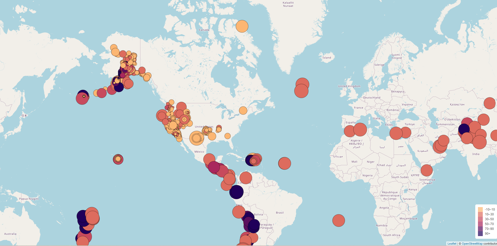
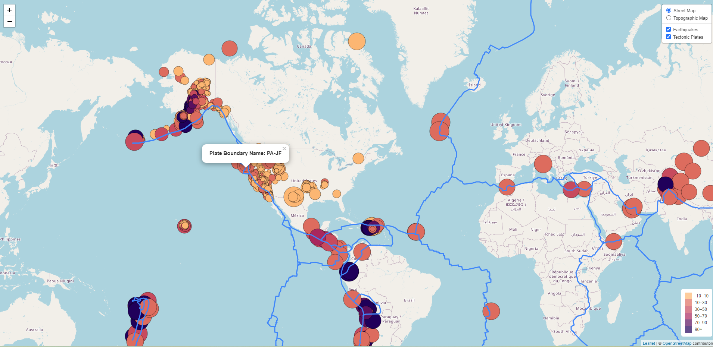
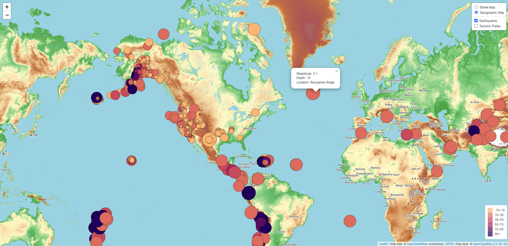

# leaflet-challenge-Earthquake

[link](https://yan-ash.github.io/leaflet-challenge/)

### Background

The United States Geological Survey, or USGS for short, is responsible for providing scientific data about natural hazards, the health of our ecosystems and environment, and the impacts of climate and land-use change. Their scientists develop new methods and tools to supply timely, relevant, and useful information about the Earth and its processes.

The USGS is interested in building a new set of tools that will allow them to visualise their earthquake data. They collect a massive amount of data from all over the world each day, but they lack a meaningful way of displaying it. In this challenge, you have been tasked with developing a way to visualise USGS data that will allow them to better educate the public and other government organisations (and hopefully secure more funding) on issues facing our planet.
 

**Table of Contents:**

1. [Purpose of the assignment](#purpose-of-the-assignment)
1. Tasks of the assignment
   - [Part 1: Create the Earthquake Visualisation](#part-1-create-the-earthquake-visualisation)
   - [Part 2: Gather and Plot More Data](#gather-and-plot-more-data)
1. Deploy of the website

### Purpose of the assignment

This challenge uses both HTML and Javascript to create custom map marker with leaflet.
 

### Task of the assignment

1.  Part 1 : Create the Earthquake Visualisation

- Use the url provide to pull in the data, create a map that plots all the earthquake from the dataset based on the longitude and latitude.
- As you can see from the map below, the circle size represents the magnitude while the color goes darker if the earthquake's depth is greater.
- when you click the circle marker, it pops up the earthquake information.

1.  Part 2: Gather and Plot more Data

- plot the tectonic plates dataset on the map.
  
- add topographic map and street map to choose from
  

3. Deploy the website
   https://yan-ash.github.io/leaflet-challenge/
